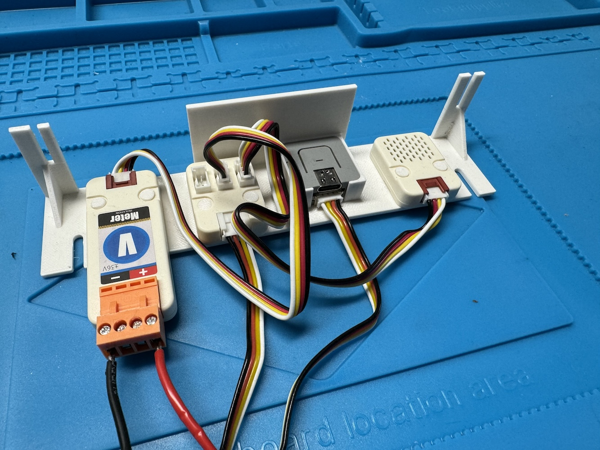
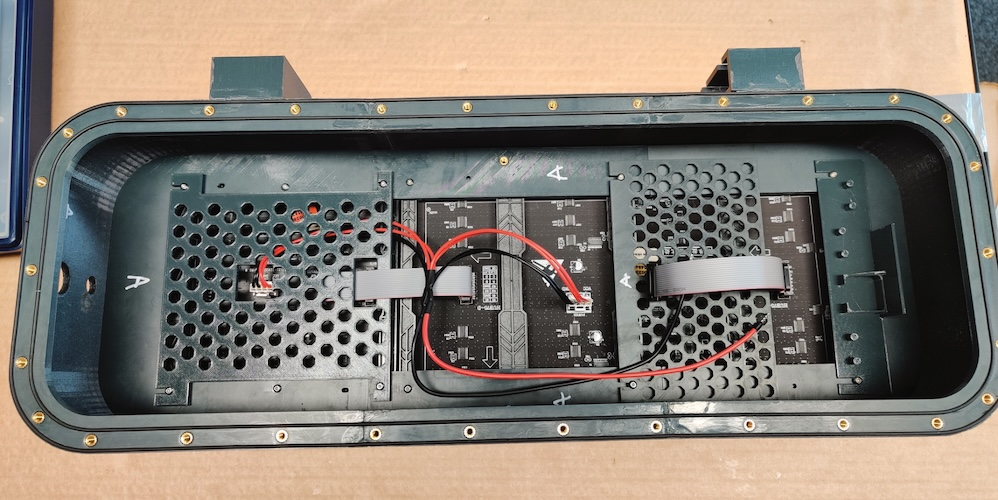

# Gehäusebau.md

>[!IMPORTANT]
># Anmerkung vorab
>Die beschriebenen LED Panels sind nur für den Betrieb an schattigen Orten geeignet (z.B. Münster Promenade). Falls ein Betrieb in der prallen Sonne geplant ist, müssten andere (hellere) LED-Panels verwendet werden.

# Gehäusebau

Eventuell sind ein paar Informationen noch unvollständig oder fehlerhaft. [Vorschläge zu Verbesserungen](https://github.com/bCyberGmbH/leezenflow-doku#kollaboration) werden dankend entgegen genommen!

## Was wir benutzt haben

| Name | Anbieter | Link |
| ---| ---| --- |
| **Gehäuse** |  |  |
| Filament 2x 1kg Prusament PETG Anthracite Grey | Prusa | [https://shop.prusa3d.com/en/prusament/1351-prusament-petg-anthracite-grey-1kg.html](https://shop.prusa3d.com/en/prusament/1351-prusament-petg-anthracite-grey-1kg.html) |
| Pattex Sekundenkleber | Amazon | [https://amzn.to/3xmu3q3](https://amzn.to/3xmu3q3) |
| Tangit PVC-U Klebstoff | Amazon | [https://amzn.to/3hkVlrk](https://amzn.to/3hkVlrk) |
| Schrauben (M3x10, M3x16 und M4x8 benötigt) | Amazon | [https://amzn.to/3AwrC6d](https://amzn.to/3AwrC6d) |
| Rundschnur Dichtung | Amazon | [https://amzn.to/3ywqAph](https://amzn.to/3ywqAph) |
| Rückseite 1,5mm Alublech AlMg3 | Lokaler Händler |  |
| Scheibe PLEXIGLAS® XT 4mm klar | Plattenzuschnitt24 | [https://www.plattenzuschnitt24.de/Plexiglas-XT-4mm-klar.html](https://www.plattenzuschnitt24.de/Plexiglas-XT-4mm-klar.html) |
| ruthex M4 Gewindeeinsatz | Amazon | [https://amzn.to/3ymEfyQ](https://amzn.to/3ymEfyQ) |
| Eisenglimmer Lack Spraydose | Amazon | [https://amzn.to/3hCJ6W0](https://amzn.to/3hCJ6W0) |
| Weidmüller DAE M12 PA LONG Druckausgleichselement M12 | Conrad | [https://www.conrad.de/de/p/weidmueller-dae-m12-pa-long-druckausgleichselement-m12-polyamid-schwarz-10-st-362049.html](https://www.conrad.de/de/p/weidmueller-dae-m12-pa-long-druckausgleichselement-m12-polyamid-schwarz-10-st-362049.html) |
|  Mast Halterung | iQ Parts | [https://www.iq-parts-shop.com/en/mounting-brackets-with-straight-legs-h008-ais.html](https://www.iq-parts-shop.com/en/mounting-brackets-with-straight-legs-h008-ais.html) |
| Silikon | Amazon | [https://amzn.to/3dMYZIo](https://amzn.to/3dMYZIo) |
| 2mm Klebeband | Amazon | [https://amzn.to/3jJBcwM](https://amzn.to/3jJBcwM) |
| Kabelverschraubung | Amazon | [https://amzn.to/3dPAjyT](https://amzn.to/3dPAjyT) |
|  |  |  |
| **Hardware** |  |  |
| Mean Well DDR-60G-5 | Mouser | [https://mou.sr/3qgm4wH](https://mou.sr/3qgm4wH) |
| Hutschienen 18,5 cm DIN Schiene 7,5x35mm gelocht  | Amazon | [https://amzn.to/3Ov7Tf4](https://amzn.to/3Ov7Tf4) |
| Rundes Doppelkernkabel 1,5 mm² 3m für Außen  | Amazon | [https://amzn.to/3KzdLTn](https://amzn.to/3KzdLTn) |
| AUPROTEC KFZ Kabel 2x1,5 mm² 3m für Innen | Amazon | [https://amzn.to/3qo2iiF](https://amzn.to/3qo2iiF) |
| DC Buchse für Raspberry LED-HAT | Amazon | [https://amzn.to/3jMWh9B](https://amzn.to/3jMWh9B) |
| Netzwerkkabel Cat6 Flach 0,25m | Amazon | [https://amzn.to/45CNHz5](https://amzn.to/45CNHz5) |
| Raspberry PI 3 B+ | Amazon | [https://amzn.to/3AztsDq](https://amzn.to/3AztsDq) |
| Hex Spacer | Amazon | [https://amzn.to/48bq4yw](https://amzn.to/48bq4yw) |
| SD Karte 32GB | Amazon | [https://amzn.to/3hBnIR3](https://amzn.to/3hBnIR3) |
| M5Stack ATOM Lite ESP32 | Amazon  | [https://amzn.to/4aiBnXK](https://amzn.to/4aiBnXK) |
| 30cm USB-A zu USB-C Kabel | Amazon | [https://amzn.to/3RHA4uf](https://amzn.to/3RHA4uf) |
| M5 ENV Sensor | Amazon | [https://amzn.to/3RnQG8R](https://amzn.to/3RnQG8R) |
| M5 Voltmeter (wenn ein Akku benutzt wird) | Amazon | [https://amzn.to/3GNVQ97](https://amzn.to/3GNVQ97) |
| M5 Grove hub (wenn das Voltmeter benutzt wird) | Amazon  | [https://amzn.to/3RJ7Mj3](https://amzn.to/3RJ7Mj3) |
| Cohda Wireless MK5 OBU | Cohda Wireless | https://www.cohdawireless.com/solutions/hardware/mk5-obu/ |
| 2 in 1 GNSS/DSRC Antenne | Mouser | [https://mou.sr/48jHY2r](https://mou.sr/48jHY2r) |
| Einzelantenne C-V2X | Mouser  | [https://mou.sr/48baK5L](https://mou.sr/48baK5L) |
| 3x Bingfu GPS DAB Antenne Adapterkabel | Amazon | [https://amzn.to/47XYt4e](https://amzn.to/47XYt4e) |
| GL-iNet Spitz 4g LTE Wireless Gateway | Amazon | [https://www.amazon.de/GL-iNet-GL-X750-Version-Installed-Dual-Band/dp/B08Q3FYJ91/](https://www.amazon.de/GL-iNet-GL-X750-Version-Installed-Dual-Band/dp/B08Q3FYJ91/) |
| Stromkabel für Router | Amazon | [https://amzn.to/3Rog4Lx](https://amzn.to/3Rog4Lx) |
| 2x Bingfu Antennenverlängerung - SMA Buchse auf SMA Stecker | Amazon | [https://amzn.to/4ae0WcB](https://amzn.to/4ae0WcB) |
| 1x LED-Panel 32x32 | Digi-Key | [https://www.digikey.de/products/de?keywords=1528-2115-ND](https://www.digikey.de/products/de?keywords=1528-2115-ND) |
| 1x LED-Panel 64x32 | Digi-Key | [https://www.digikey.de/product-detail/de/adafruit-industries-llc/2277/1528-2504-ND/7035035](https://www.digikey.de/product-detail/de/adafruit-industries-llc/2277/1528-2504-ND/7035035) |
| RGB LED Matrix Hat | Digi-Key | [https://www.digikey.de/product-detail/de/adafruit-industries-llc/2345/1528-1432-ND/5699181](https://www.digikey.de/product-detail/de/adafruit-industries-llc/2345/1528-1432-ND/5699181) |
|  |  |  |

**Verbrauchsmaterial**
- Wago Klemmen (3er und 5er)
- Kabelbinder (kurz und lang)
- Aderendhülsen 1,5mm²
- Kosten Verbrauchsmaterial
- Silica-gel Beutel

Außerdem Werkzeug:

*   3D-Drucker (wir haben einen [Prusa i3 MK3S+ Drucker](https://shop.prusa3d.com/de/3d-drucker/181-original-prusa-i3-mk3s-drucker.html) und einen [Bambu Lab X1](https://eu.store.bambulab.com/de/products/x1-carbon-combo) benutzt)
*   Gummihammer
*   Schmirgelpapier
*   Holzspatel
*   Malerkrepp-Klebeband
*   Crimpzange
*   Abisolierwerkzeug
*   Kabel-Entmanteler
*   Lötkolben

## Aufwand

| Posten | Personentage |
| ---| --- |
| Bestellung/Vorbereitung Planung | 0,5 |
| 3D Druck | 0,5 (hängt vom verwendeten 3D-Drucker ab) |
| Gehäuse Bau | 1 |
| Gehäuse Innenleben/Hardware | 0,5 |
| Installation/Konfiguration/Einrichtung | 0,5 |
| Summe | 3 |

## Bestellung Rückwand + Scheibe

Maße und Details der Scheibe:

*   Plexiglas antireflex 2mm
*   Form: Rechteck runde Ecken
*   Breite: 19,3 cm
*   Höhe: 55,5 cm
*   Radius: 4,4 cm
*   Entgraten: Ja
*   Kantenbearbeitung: Gelasert

Maße und Details der Rückwand:

*   Länge: 570 mm
*   Breite: 205 mm
*   Außenecken abgerundet: 50 mm Radius
*   Blech entgraten: Ja
*   Material: 1,5mm Alublech AlMg3

## 3D-Druck

Für den 3D-Druck haben wir einen [Prusa i3 MK3S+ Drucker](https://shop.prusa3d.com/de/3d-drucker/181-original-prusa-i3-mk3s-drucker.html) genutzt.

Zum Slicen wurde [PrusaSlicer](https://www.prusa3d.de/prusaslicer/) verwendet. Als "Print Settings" haben wir die Voreinstellung 0.20mm QUALITY genutzt und nur einen Parameter angepasst: Infill -> [Combine infill every](https://help.prusa3d.com/en/article/infill_42#combine-infill-every-x-layers) von 1 auf 2 erhöht. Für die Filament Einstellung haben wir "Prusament PETG" ohne Anpassung genutzt.

Außerdem haben wir einen [Bambu Lab X1](https://eu.store.bambulab.com/de/products/x1-carbon-combo) mit Bambu PETG-CF Filament benutzt. Mit diesem konnten wir die Gehäuse um einiges schneller drucken als mit dem Prusa i3 MK3S+.

Alle `.stl` Dateien für den Druck befinden sich im Ordner [3d-print im Design Repository](https://github.com/bCyberGmbH/leezenflow-design/tree/main/3d-print).

Die Datei `mast-halterung.stl` muss 2x gedruckt werden, alle anderen Dateien 1x.

## Zusammenbau

Alle gedruckten Teile, mit dem Präfix `case` im Namen + die beiden Masthalterungen, müssen mit dem PVC-U Kleber verklebt werden. Hier nicht mit Kleber sparen! Die Klebestellen müssen später wasserdicht sein. Eventuelle Lücken können mit Sekundenkleber (da dieser dünnflüssiger ist) nachgebessert werden.

*   Zum Auftragen des Klebers sollte man z.B. Einweg-Holzspatel nutzen.
*   Bei sehr warmen Wetter kann der Kleber zu schnell trocknen, am besten den Kleber vorher kühlen.
*   Zum zusammenfügen der Teile kann es nötig sein (z.B. mit einem Gummihammer) ein wenig nachzuhelfen.
*   Klebereste, die von außen zu sehen sind, sollten vor dem Lackieren entfernt werden. Außerdem die Oberfläche mit Schmirgelpapier anrauen.

Auch die seitlichen Halterungen am Gehäuse ankleben. Dazu die komplette Kontaktfläche mit Kleber bedecken.

Darauf achten, die Halterungen komplett einzuschieben. Stehen die Halterungen zu weit oben, kann das Gehäuse undicht werden!

Nach dem Verkleben müssen noch die Gewindeeinsätze mit dem Lötkolben auf der Rückseite eingelassen werden. Dafür die Gewinde mit dem Lötkolben in die vorgedruckten Löcher drücken, bis sie bündig mit dem Gehäuse sind. Dabei darauf achten möglichst gleichmäßig und gerade Druck auszuüben, damit die Gewinde nicht schief werden.

Außerdem muss jeweils ein Gewindeeinsatz in die äußeren Löcher der Teile led-rahmen-seite-l.stl und led-rahmen-seite-r.stl eingelassen werden, um die Hutschiene zu befestigen.

## Lackieren

Vor dem Lackieren sollten alle Schmirgelreste entfernt werden. Die Rückseite (die Seite mit den Gewindeeinsätzen) nicht lackieren! Am besten mit Malerkrepp-Klebeband abkleben. 2 Lackschichten auf allen Teilen sollten ausreichen.

Zudem darauf achten, dass das Loch unten an der Vorderseite frei bleibt. Dies dient zum Abfluss von Regenwasser.

Zusätzlich zum Gehäuse muss auch der LED Rahmen von oben (Orientierung genau wie auf dem Druckbett) lackiert werden.

## Dichtungen

Die beiden Dichtungsrillen auf der Rückseite mit dem 2 mm doppelseitigem Klebeband auslegen. Anschließend die Rundschnur einkleben. Dabei die Naht der Schnur im unteren Bereich des Gehäuses platzieren (blauer Pfeil). Diesen Schritt sollte man am besten erst direkt vor dem anschrauben der Rückwand ausführen, da sich die Dichtungen sonst wieder ablösen könnten, wenn diese lange ohne Gegendruck herumliegen.

## LED-Panels mit Rahmen einbauen

Das nachfolgende Bild zeigt die Position der Schrauben.

Blau markiert = M3x10 Schraube

Rot markiert = M3x16 Schraube

Gelb markiert = M4x8 Schraube

Achtung: Den Rahmen noch nicht komplett verschrauben. Er muss aus Platzgründen in 2 Schritten in das Gehäuse eingebaut werden.

Im ersten Schritt die abgebildeten Rahmenteile verschrauben und in das Gehäuse einlegen (wie abgebildet ohne das obere Rahmenteil):

Anschließend das fehlende Rahmenteil einfügen und mit dem LED-Panel verschrauben.

### Raspberry PI

Die SD-Karte wie [hier](https://github.com/bCyberGmbH/leezenflow-code#installation) beschrieben vorbereiten und in den Raspberry einsetzen.

Den RGB LED Matrix Hat vorbereiten, wie in [leezenflow-code](https://github.com/bCyberGmbH/leezenflow-code#requirements) beschrieben (Brücke zwischen GPIO Pin 4 und 18 löten).

Anschließend den RGB LED Matrix Hat auf den Raspberry stecken und mit den Hex-Spacern fixieren.

### Einrichtung des Routers (wenn ein "GL-X750V2 Spitz" benutzt wird)

*   Sim Karte einsetzen
*   Antennen mit Verlängerung anschrauben
*   Rechner mit Kabel in LAN Port verbinden
*   Router anschalten
*   Warten bis PC IP Adresse hat (Aus Bereich 192.168.8.x)
*   Web UI auf [http://192.168.8.1](http://192.168.8.1) öffnen
*   Den WAN-Port auf der Hauptseite mit der Option "Cable: Using as WAN, change" zu einem LAN-Port ändern
*   WiFi Abschalten (2.4G und 5G)
*   APN einrichten
*   More Settings ➝ Lan IP auf 10.0.0.1 ändern (dann kurz warten, bis der Router die IP übernimmt und dem Rechner eine neue IP aus dem Bereich gibt.)

### M5 Atom lite einrichten

Die Software für den Sensor ist in diesem Repository hinterlegt: https://github.com/bCyberGmbH/leezenflow-sensor

Die Sensordaten können dann z.B. in eine Monitoring Lösung weitergeleitet werden.

Den M5 Atom lite, das Voltmeter, den hub und den ENV Sensor wie folgt zusammenbauen und an den obersten Schrauben im Gehäuse verschrauben

## Vorbereitung Einbau

Wir haben das Hutschienen-Netzteil mit der Stellschraube auf 5,2 V Ausgangsspannung eingestellt. Dadurch konnten wir ein etwas geringeres flackern bei den LED-Panels erzielen.

Die Enden des LED-Panel Stromkabels mit den Kabelschuhen abschneiden, abisolieren und mit den Aderendhülsen Crimpen.

Mehrere Fahrzeugleitungen vorbereiten (jeweils immer ein schwarzes und rotes Kabel):

*   1x ca. 30cm für Hutschienen-Netzteil output zu Raspberry (DC-Buchse)
    *   Beide Seiten abisolieren und mit Aderendhülsen Crimpen
*   1x ca. 30cm für Voltmeter zu Wago-Klemme (falls benutzt)
    *   Beide Seiten nur abisolieren und nicht Crimpen
*   1x ca. 20cm für Wago-Klemme zu Hutschienen-Netzteil Input
    *   Beide Seiten abisolieren und nur eine Seite mit Aderendhülsen Crimpen

Das Stromkabel der OBU am Ende abschneiden und abisolieren, so dass man 2 rote und 2 schwarze Kabel hat.

Die 2 in 1 Antenne und die Einzelantenne mit den Adapterkabeln verbinden und an die OBU anschließen. Dabei auf die richtigen Anschlüsse achten. Das GNSS Kabel der 2 in 1 Antenne muss an den GNSS Anschluss der OBU.

Wir nutzen ein Custom-Image für die OBU, welches die Daten der Ampel mitschneidet, umwandelt und per MQTT an unseren Raspberry sendet. Für Infos zu dem Custom-Image, bitte eine Anfrage an uns senden.

## Verkabelung und Hardware-Einbau

### Verkabelung vor Kabelmanagement

Zuerst das Hutschienen-Netzteil anbringen.

Dann das Stromkabel der LED-Panels an die zwei LED-Panels anschließen. Das Ende des Stromkabels muss in den Hutschienen-Netzteil Output gesteckt werden.

Nun das Flachbandkabel zwischen den LED-Panels wie abgebildet anschließen.

Anschließend das Flachbandkabel des LED-Panels mit dem RGB LED Matrix HAT verbinden.

Danach können die Hardwarehalterungen angebracht werden. Dafür vorher auf der oberen Hardwarehalterung den Raspberry und auf der unteren die OBU, z.B. mit Kabelbindern, befestigen. Auf der OBU wird danach dann noch der LTE-Router befestigt und dann können die Hardwarehalterungen mit den M3x16 Schrauben auf dem Rahmen angebracht werden.

Für den Strom am Raspberry dann die eine 30cm Fahrzeugleitung an das Hutschienen-Netzteil anschließen und die andere Seite mit der DC Buchse in den LED-HAT stecken.

Dann noch den Atom lite per USB Kabel mit dem Raspberry verbinden.

Als nächstes wird die 20cm Fahrzeugleitung mit den Aderendhülsen in den Input vom Hutschienen-Netzteil angeschlossen und die andere Seite wird in die 5er Wago-Klemmen gesteckt.

Danach das Stromkabel für den Router mit dem Router und den Wago-Klemmen verbinden und ebenso das Stromkabel der OBU mit der OBU und den Wago-Klemmen verbinden.

Dann die Antennen von dem Router und die Einzelantenne der OBU an die Antennenhalter anschrauben und am Rahmen Befestigen.

Die 2 in 1 Antenne der OBU wird oben zwischen Decke des Gehäuses und der Sensorenhalterung angebracht. Dafür die Sensorenhalterung losschrauben, die Antenne zwischenschieben und die Halterung wieder möglichst eng anschrauben.

Als nächstes können die Lankabel vom Pi und der OBU and den Router angeschlossen werden.

Danach wird der Silica-Gel Beutel ins Gehäuse gelegt und zuletzt müssen dann noch das Druckausgleichselement und die Kabeldurchführung mit dem 3m Stromkabel angebracht und das Stromkabel in die Wago-Klemmen gesteckt werden.

## Scheibe einkleben

Die Scheibe muss eventuell an den Kanten noch etwas beigeschliffen werden. Anschließend die Scheibe mit dem Silirub ProN von vorne abdichten (grüne Linie).

Dabei darauf achten, dass das Loch frei bleibt.

## Rückwand

In die Rückwand müssen an den Stellen der Gewindeeinsätze Löcher für die M4-Schrauben gebohrt werden. Ein Versuch, die Platte vom Zulieferer bohren zu lassen, war bei uns leider nicht erfolgreich (vermutlich wegen der leichten Toleranzen durch 3D Druck und Verkleben der Elemente).

Bevor die Rückwand aufgelegt wird noch eine Schicht normales Silikon zwischen den beiden Dichtungen und über/in die Gewinde auftragen. Danach die Rückwand mit den M4-Schrauben verschließen.
